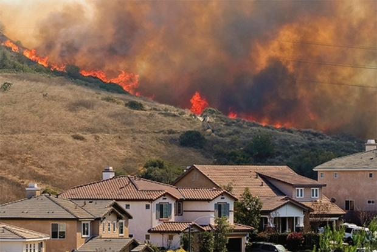
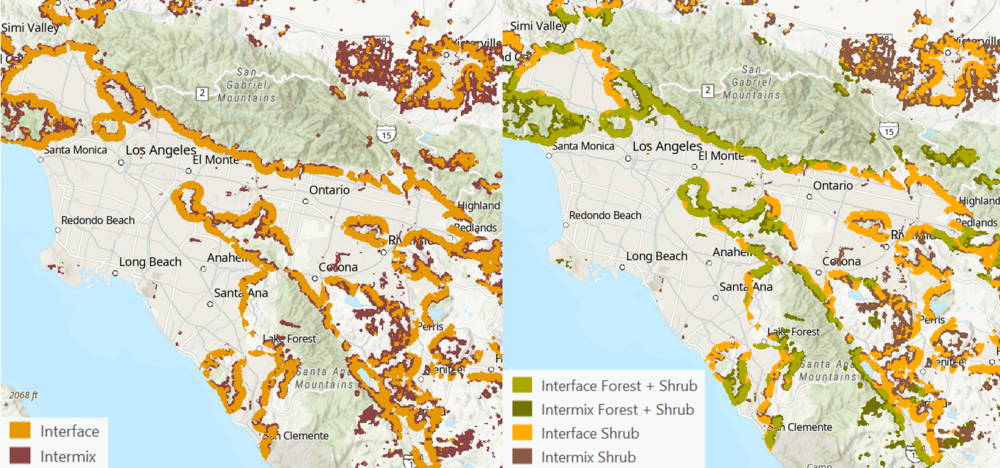
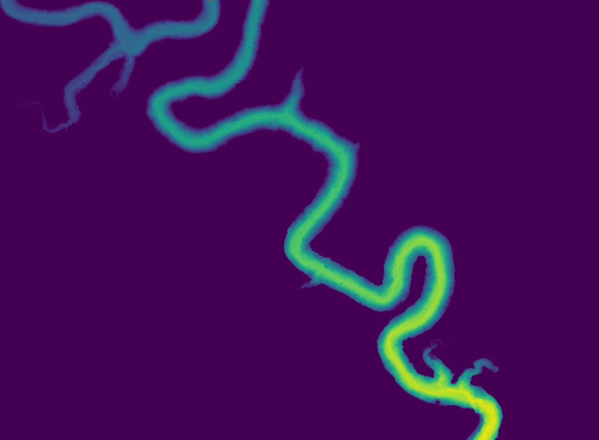
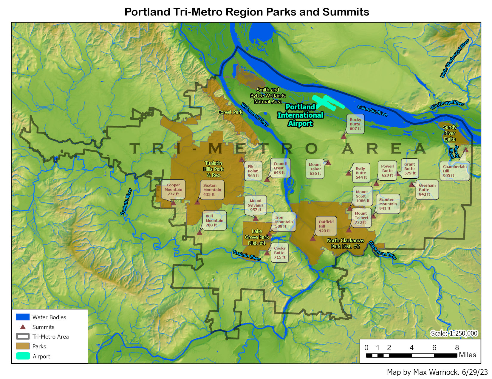
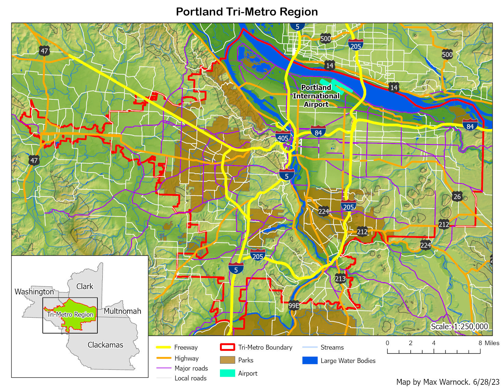
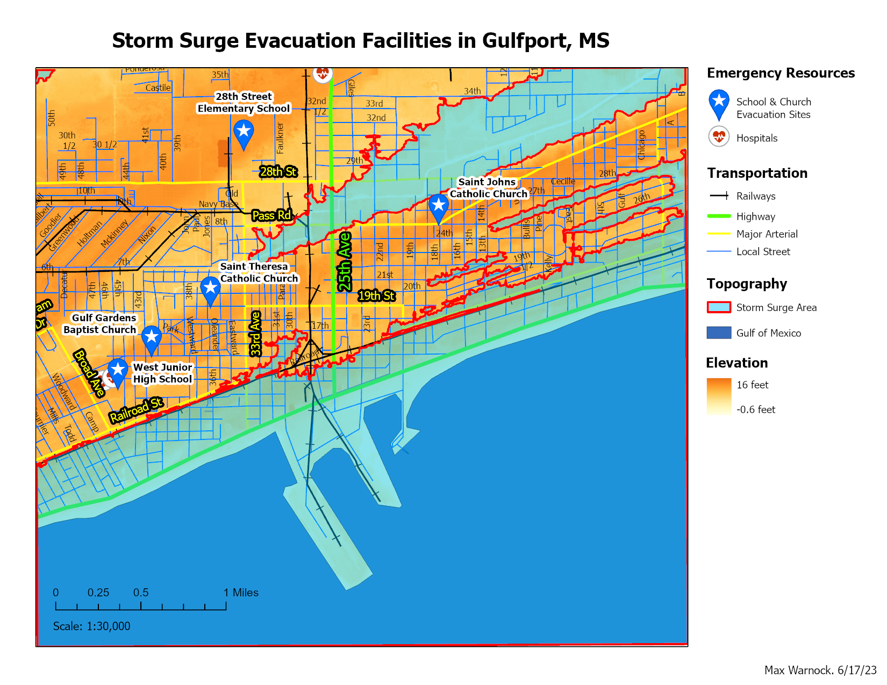
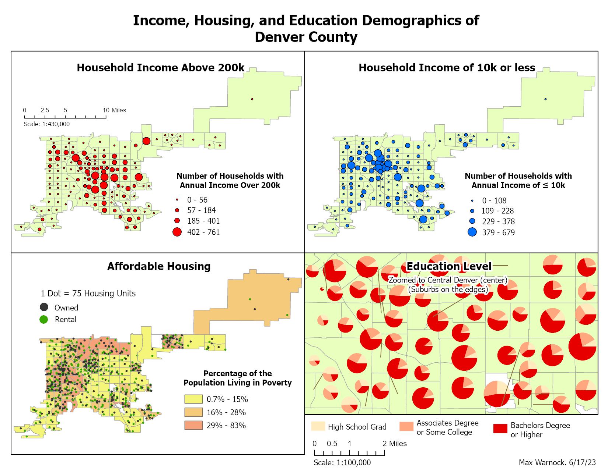
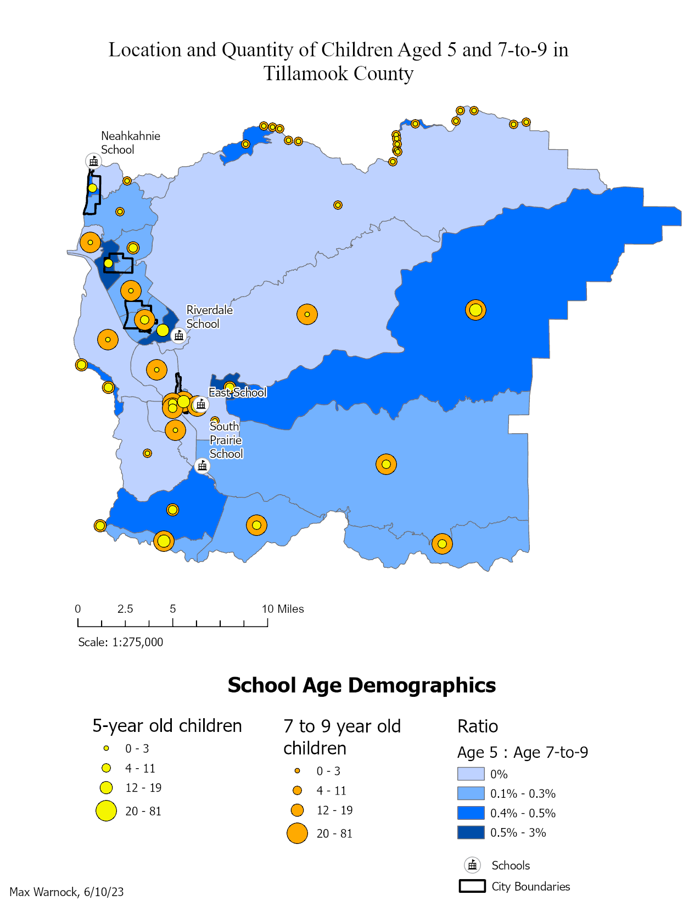
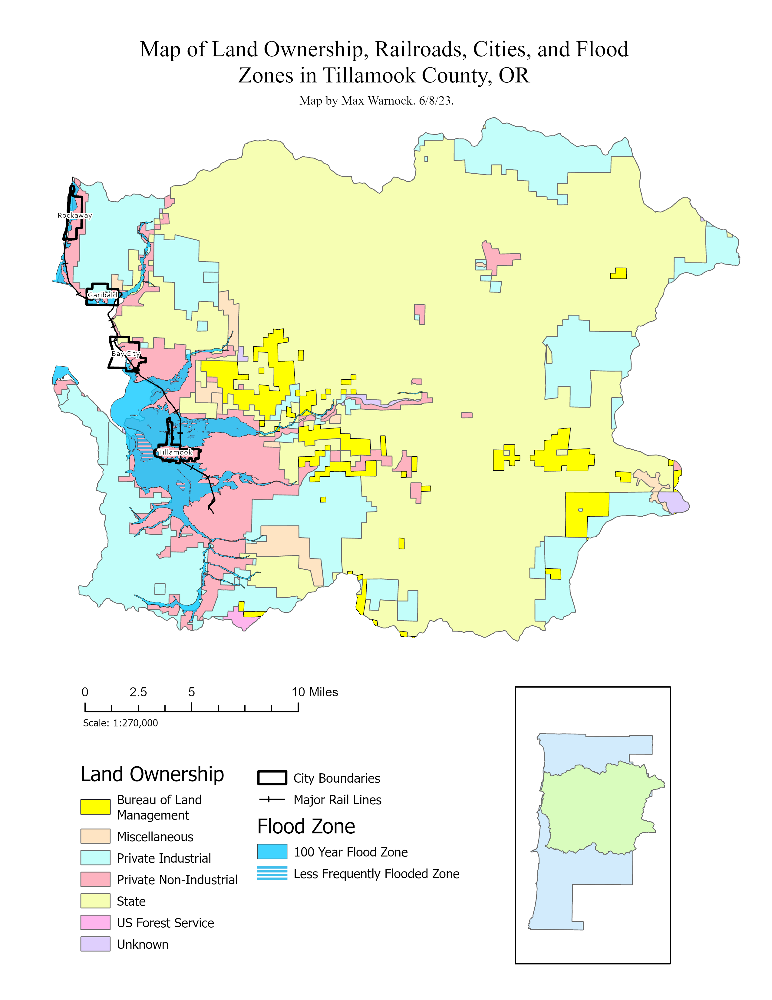

# GIS Portfolio

## A Tool for Mapping Wildland Urban Interface {#wui}
5/4/25    
Final Project for GEOG 4303 - Spatial Programming

Project leader: Max Warnock    
Team members: Quin Browder, Victoria Madden

[Link to the full research paper and code repository](https://github.com/maxwarnock/wui_mapping)

    
    
Image credit: NOAA

<strong>Introduction</strong>  
Between the bustling centers of urban development and the untamed wilderness lies a
boundary called the Wildland-Urban Interface (WUI). As suburban sprawl increases, so does the
WUI and its risks. This interface poses an opportunity for fire to spread from one type of land to
another – wildfires can enter the city and structure fires can spread to the forest [3]. Mapping this
boundary and its properties allows for identification of areas which present the largest risk of a
wide-spread fire and can help determine the best fire mitigation strategies for these areas.

**Wildland Urban Interface (WUI) Definition**
The WUI is an area where structures are built in or near wildland vegetation [2]. The U.S.
Federal Register defines the WUI as an area with at least 6.17 structures per square kilometer
and one of two vegetation requirements: either 50% or more of the land is covered in vegetation,
or the structures are within 2.4 kilometers of at least 5 square kilometers of 75% vegetation
coverage [10]. The first of these categories is considered the Wildland-Urban Intermix, and the
second is Wildland-Urban Interface [2]. However, different research questions may be interested
in slightly different mapping requirements, so these standard values are not hard coded into our
tool. Instead, the user inputs all the requirements for the intermix and interface including
thresholds for building density, vegetation cover, buffer distance to large areas of vegetation,
large vegetation area definitions, and moving window radii. The user can also request that the
interface and intermix be mapped using classifications representing proximity to the most
prominent vegetation types in the area.

    
    

<strong>Mapping and Data Sources</strong>  
Our tool uses vegetation data from the National Land Cover Database (NLCD) [11], and
structure data from the Built-Up Property Locations (BUPL) layer from the Historical Settlement
Data Compilation for the U.S. (HISDAC-US) [1]. The tool package comes with clipped sample
data for Los Angeles, CA 2020, and the user also has the option to input data for other areas of
interest anywhere in the U.S. Both data sets are available back to 1985. The tool is designed so
that the user can simply clip an NLCD raster to their study area of interest, and the tool will clip
the BUPL layer (e.g. if using an unclipped BUPL layer (~30MB) for the entire U.S.). The NLCD
raster is provided at 30-meter resolution and has many classes representing different vegetation
types, as well as development data which we ignore [11]. The BUPL raster is provided at 250-
meter resolution and shows the number of structures within each cell [1].

**Mapping and Data Sources**
Our tool uses vegetation data from the National Land Cover Database (NLCD) [11], and
structure data from the Built-Up Property Locations (BUPL) layer from the Historical Settlement
Data Compilation for the U.S. (HISDAC-US) [1]. The tool package comes with clipped sample
data for Los Angeles, CA 2020, and the user also has the option to input data for other areas of
interest anywhere in the U.S. Both data sets are available back to 1985. The tool is designed so
that the user can simply clip an NLCD raster to their study area of interest, and the tool will clip
the BUPL layer (e.g. if using an unclipped BUPL layer (~30MB) for the entire U.S.). The NLCD
raster is provided at 30-meter resolution and has many classes representing different vegetation
types, as well as development data which we ignore [11]. The BUPL raster is provided at 250-
meter resolution and shows the number of structures within each cell [1].

**Methods**
Our tool begins with data preparation and utilizes ArcPy tools for this task. Since we are
using data sources with two different resolutions, we begin by resampling the smaller resolution
of the NLCD data to match the larger resolution of the BUPL data. This means that there is some
loss of data resolution for vegetation, but it allows us to use the HISDAC-US data source. We
also reproject the NLCD to match the BUPL projection to ensure that the rasters are comparable.
Finally, we use the ExtractByMask tool to clip the BUPL data to the input NLCD extent. We
found that ExtractByMask works better than ClipRaster for this purpose because the clip tool
produces “NoData” values on the edges of the raster which causes problems with future steps.
We also used the ArcPy SnapRaster feature to ensure that both rasters have the same size and
number of rows and columns [4]. Finally, we convert both NLCD and BUPL rasters into NumPy
arrays which allows us to start performing selections and map algebra operations very quickly
and effectively.

After data preparation is complete, our WUI mapping method follows six general steps
derived in part thanks to the method outlined by Bar-Massada, et al [2]. The variables used
below are the accepted standard values used in WUI mapping [2, 6], and users can input different
values if they want to adjust the mapping output:

1. Run a moving window on the BUPL data and select cells with at least 6.17 buildings
within a 1 km radius.

2. Run a moving window on NLCD vegetation (classes 41, 42, 43, 51, 52, and 72) to select
areas with greater than and less than 50% vegetation.

3. From the raw resampled/post-processed NLCD data, select vegetation groupings of 5
square kilometers in areas of at least 75% vegetation cover using Region Group tool.

4. Buffer the 5 square kilometer vegetation areas to a given radius of 2.4 km.

5. Calculate WUI intermix by adding outputs from step 1 and 2.

6. Calculate WUI interface by adding the building density output from step 1, the vegetation
selection of areas less than 50% from step 2, and the large vegetation area buffer from
step 4.

## Salvation Army Volunteer GIS Work {#salvarmy}


<arcgis-embedded-map 
    style="height:600px;width:100%;" 
    item-id="ee10287c145d43b2be3b647c7ad15bee"
    theme="light" 
    share-enabled 
    center="-108.74416013251762,43.336786737727394"
    scale="18489297.737236"
    portal-url="https://ucboulder.maps.arcgis.com">
</arcgis-embedded-map>


During fall 2025, I volunteered with the Intermountain Division of the Salvation Army to create an interactive map of the division using ArcGIS Pro. Input data from the division included basic data tables of corps and service centers, and related information such as zip codes of service. From this, I wrote a Python script utilizing arcpy tools to generate the map above. This map will be used on the [Salvation Army Intermountain Division website](https://intermountaineds.salvationarmy.org/intermountain_emergency_disaster_services/) as a way for users to search for resources available to them. 

# Remote Sensing Projects {#remote-sensing}

## Remotely Sensing Glacial Retreat and Snowpack Levels in Saas Fee, Switzerland From 2013 to 2024
12/1/24   


<a href="https://sites.google.com/colorado.edu/geog4093finalproject/home?authuser=1" target="_blank" rel="noopener noreferrer">
    Link to Project Webpage
</a>


## Spatial Analysis of the Glaciers in Grant Teton National Park between 1994 to 2015    


<iframe 
    src="https://drive.google.com/file/d/11UZ70_EuOYQTBxUNrOJ6ak_MlCxGjZFy/preview" 
    width="100%" 
    height="500px"
    allow="autoplay">
</iframe>


Animated visualization of the 2023 bomb cyclone in California. I created this GIF in QGIS using the Copernicus Climate Data Store. 

Relative Elevation Model (REM) image of a section of the Escalante River in Utah. Image created in QGIS. 

# Cartography Examples {#cartography}

**Figure 1:** Population density maps of the Portland Tri-Metro area shown with different choropleth classification methods. Certain methods are useful for different data distributions. In this case, the quantile method shows the most difference between zones. 

**Figure 2:** Map of the Portland Tri-Metro area showing the airport, parks, summits, water bodies, general topography, and the boundary of the Tri-Metro area. 

**Figure 3:** Map of the Portland Tri-Metro area showing roads.

**Figure 4:** Map of Gulfport, MS, showing storm surge areas based on elevation as well as emergency resources. 

**Figure 5:** In this figure, the top two maps compare the locations of high income households (>200k), and low income households (<10k) in Denver, CO. The bottom left map shows locations of affordable housing, and the bottom right shows a zoomed in snapshot of education levels within central Denver. Data for these maps was taken from the U.S. Census and the Denver Regional Council of Governments (DRCOG). 

**Figure 6:** Map showing locations of school-aged children in Tillamook County, OR. This map could be used to help determine locations for new schools. 

**Figure 7:** Map showing land ownership, railroads, cities, and flood zones in Tillamook County, OR. This map could be used for general planning purposes. 

## Writing Examples {#writing}
<iframe 
    src="maps/uncertainty_essay.pdf" 
    width="100%" 
    height="900px"
    allow="autoplay">
</iframe>

<iframe 
    src="maps/scale_essay.pdf" 
    width="100%" 
    height="900px"
    allow="autoplay">
</iframe>
