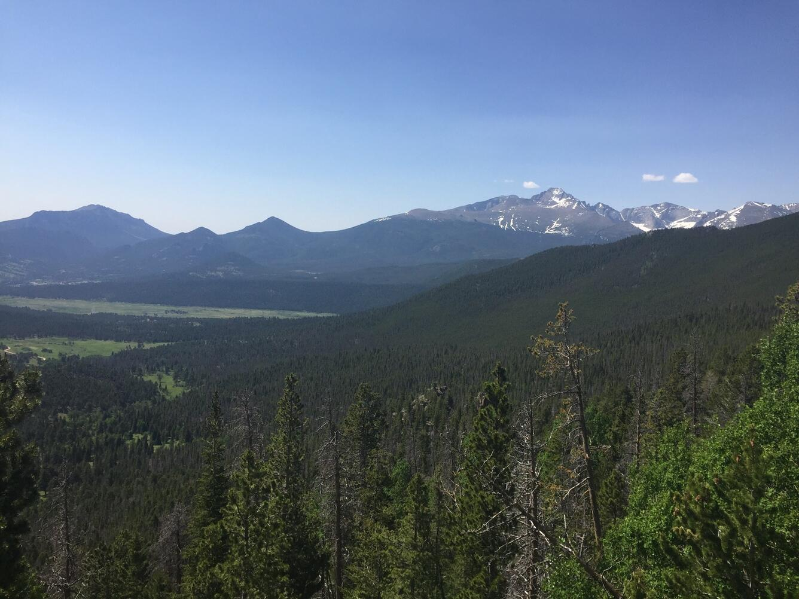
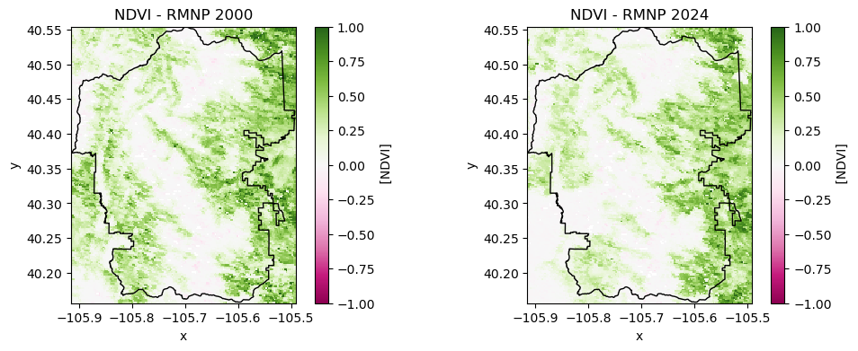
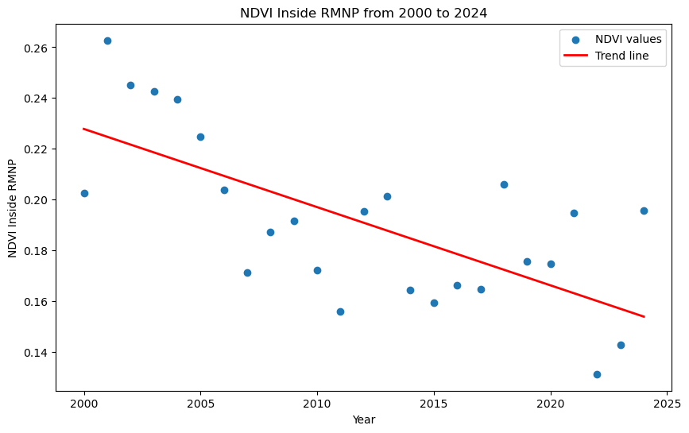
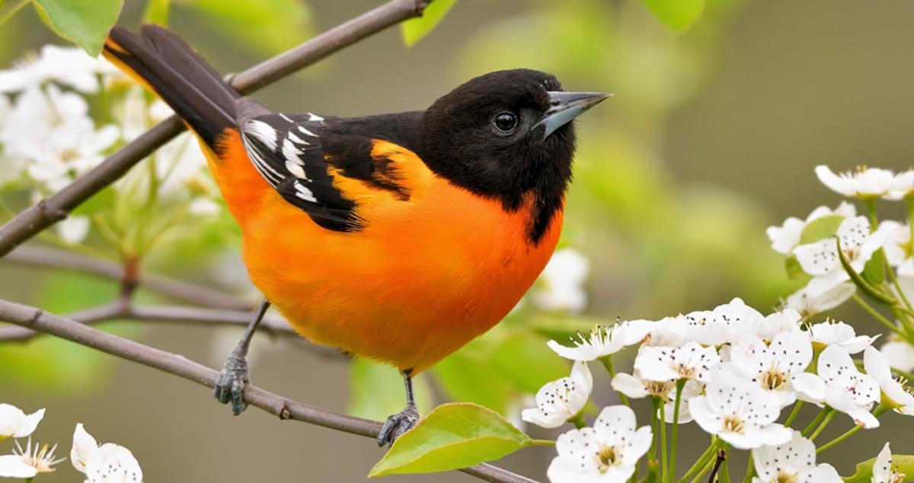

# Earth Data Analytics Portfolio

## Analysis of the Migration Range of the American Redstart (Setophaga ruticilla) from 2004 to 2024 {#redstart}
12/10/25

[Link to my complete analysis, Python code, and repository](./migration_download_steps.md)

  
<strong>Introduction</strong>  
  The American Redstart (Setophaga ruticilla) is a colorful warbler that migrates across the Americas each year. Males have a dark black head and chest, with bright orange on the wings, sides, and tail, while females are a lighter grey color with yellow highlights. These warblers prefer nesting in open woodlands across North America <a href="https://www.allaboutbirds.org/guide/American_Redstart/overview"
    target="_blank"
    rel="noopener noreferrer">(Cornell Lab of Ornithology)</a>). They spend the winters in Central and South America, and migrate as far as Northern Canada for breeding during the summer. Like many migratory birds, climate change and human developments are impacting the Redstart's migration patterns and survival according to the (<a href="https://www.caryinstitute.org/news-insights/feature/climate-change-pushing-american-redstarts-breeding-range-southward"
    target="_blank"
    rel="noopener noreferrer">Cary Institute of Ecosystem Studies</a>).

**Research Question**    
Is there an identifiable change or trend in the extent of the American Redstart's total annual range from 2004 to 2024? 

**Migration Patterns, Climate Change, and Deforestation**
American Redstarts are being affected by climate change in some parts of their migration range. According to Bryant Dossman, a conservation and migration ecology scientist, Redstarts are particularly affected by increasingly dry conditions in the tropics of South America and Jamaica where many Redstarts spend the winter [(Heisman, 2024)](https://www.allaboutbirds.org/news/american-redstarts-can-speed-up-their-migration-but-theres-a-cost/). There is strong evidence that increasingly dry conditions in the tropics are linked to climate change and deforestation [(Y. Malhi, et al)](https://royalsocietypublishing.org/rstb/article-abstract/359/1443/331/20382/Tropical-forests-and-the-global-carbon-cycle?redirectedFrom=fulltext) and [(Franco. M.A, et al)](https://doi.org/10.1038/s41467-025-63156-0). According to Dossman, these conditions are making it harder for the Redstart to find enough food and insects to put on enough weight for the migration journey north. Dossman observes that this causes the Redstart to often leave later in the spring. Dossman used GPS tracking devices on the birds to study their migration speed. He found that bird that left late migrated faster to make up for lost time. However, he notes that migrating faster increases stress and energy expenditure of the birds, making them more likely to die on the journey. Dossman found that birds that left late had a 6% increased risk of death on their migration journey as opposed to birds that left on time [(Heisman, 2024)](https://www.allaboutbirds.org/news/american-redstarts-can-speed-up-their-migration-but-theres-a-cost/). Another similar study from 2015 found very similar results to Dossman [(Cooper, N.W, et al)](https://doi.org/10.1890/14-1365.1). 

These studies indicate that an increasing lack of resources in South America is impacting the Redstart's range. According to the Cary Institute of Ecosystem Studies, the Redstart is migrating farther south into South America during the winters in search of food, and not as far north into Canada during the summers because of the delay migrating north. The overall effect is that the Redstart's range is shifting southwards [(Cary Institute of Ecosystem Studies)](https://www.caryinstitute.org/news-insights/feature/climate-change-pushing-american-redstarts-breeding-range-southward).

**Migration Mapping**    
Because of the impacts described above, knowing the month-by-month range of the Redstart's migration path can be a useful tool for conservation efforts. In addition to the month-by-month range, assessing the range over years and decades can confirm important information about how climate change and deforestation is impacting the Redstart's range. 

**Migration Data from GBIF**    
To map the Redstart's annual migration, I will be using occurrence data from the [Global Biodiversity Information Facility (GBIF)](https://www.gbif.org/). Occurrence data is largely collected using [eBird](https://ebird.org/home) and [iNaturalist](https://www.inaturalist.org/), as well as several other reputable citizen science data sources [(GBIF Data Processing)](https://www.gbif.org/data-processing).

**Ecoregion Data**    
I will be plotting occurrence (sightings of Redstarts) data within ecoregions to visualize the Redstart migration on a map. For the ecoregion data, I will be using data published in 2017 by [RESOLVE](https://www.resolve.ngo/) and [OneEarth](https://www.oneearth.org/announcing-the-release-of-ecoregion-snapshots/).

**Results**

  <iframe src="img/redstart-migration-2004.html" style="width: 100%; height: 370px; border:none;"></iframe>
  <iframe src="img/redstart-migration-2009.html" style="width: 100%; height: 370px; border:none;"></iframe>
  <iframe src="img/redstart-migration-2014.html" style="width: 100%; height: 370px; border:none;"></iframe>
  <iframe src="img/redstart-migration-2019.html" style="width: 100%; height: 370px; border:none;"></iframe>

**Figure 1:** Maps showing the month-by-month migration patterns of the American Redstart for years 2004, 2009, 2014, 2019. Density of observations is represented by the blue color scale. 

<embed type="text/html" src="/img/redstart-migration-years.html" width="800" height="650">

**Figure 2:** Map showing the entire range of the American Redstart for the years of 2004, 2009, 2014, 2019, and 2024. Density of observations for the entire year is represented by the blue color scale. Yearly density values were calculated by taking the sum of monthly normalized occurrence values. See my download-200X.ipynb files in my repository for a full explaination of normalization steps.

**Analysis**    
The map above shows the entire migration range of the Redstart for the years of 2004, 2009, 2014, 2019, and 2024. In 2004, notice the northern extent of the Redstart in Northwestern Canada. This ecoregion disappears in later years, meaning the Redstart has not been observed in that northern ecoregion in more than a decade according to the GBIF data. As you scroll through the years, also notice the range extent in South America. In 2004, the range is fairly limited in South America. However, the Redstart's range in South America has gradually been increasing southward, as well as the density of observations. Notice that the density of observations in 2004 is relatively low. However, in more recent years, the density is much higher. 

**Conclusion**    
According to the [Cornell Lab of Ornithology](https://www.allaboutbirds.org/guide/American_Redstart/overview), the [Cary Institute of Ecosystem Studies](https://www.caryinstitute.org/news-insights/feature/climate-change-pushing-american-redstarts-breeding-range-southward), and the study by [Cooper et al](https://doi.org/10.1890/14-1365.1), the American Redstart's migration range has been forced southwards in recent decades due to climate change impacts on their habitat, particularly in Central and South America. This analysis focused on two decades of data of GBIF observations of the Redstart's range in order to observe trends in the extent of the Redstart's range. The resulting map shows an increase in the extent of the Redstart's southern range during the winter months, indicating that the bird is venturing farther into South America in search of food. Additionally, the Northern range reduced slightly. These findings are consistent with the studies cited above, showing that the Redstart's range is being affected by climate change and deforestation. While the species appears to be adapting and its population is stable, these affects are putting an increased strain on its migration patterns and could lead to more negative impacts in the future if conditions worsen [(Heisman, 2024)](https://www.allaboutbirds.org/news/american-redstarts-can-speed-up-their-migration-but-theres-a-cost/).

**Works Cited**    
Cary Institute of Ecosystem Studies. Climate change is pushing the American redstart’s breeding range southward. https://www.caryinstitute.org/news-insights/feature/climate-change-pushing-american-redstarts-breeding-range-southward

Cooper, N.W., Sherry, T.W. and Marra, P.P. (2015), Experimental reduction of winter food decreases body condition and delays migration in a long-distance migratory bird. Ecology, 96: 1933-1942. https://doi.org/10.1890/14-1365.1 

Cornell Lab of Ornithology. American Redstart. https://www.allaboutbirds.org/guide/American_Redstart/overview 

Franco, M.A., Rizzo, L.V., Teixeira, M.J. et al. How climate change and deforestation interact in the transformation of the Amazon rainforest. Nat Commun 16, 7944 (2025). https://doi.org/10.1038/s41467-025-63156-0

Heisman, Rebecca. American Redstarts Can Speed Up Their Migration, but There’s a Cost. Cornell Lab of Ornithology. 2024. https://www.allaboutbirds.org/news/american-redstarts-can-speed-up-their-migration-but-theres-a-cost/.

Y. Malhi, O. L. Phillips, Wolfgang Cramer, Alberte Bondeau, Sibyll Schaphoff, Wolfgang Lucht, Benjamin Smith, Stephen Sitch; Tropical forests and the global carbon cycle: impacts of atmospheric carbon dioxide, climate change and rate of deforestation. Philos Trans R Soc Lond B Biol Sci 29 March 2004; 359 (1443): 331–343. https://doi.org/10.1098/rstb.2003.1428

## Analysis of Vegetation Health in Rocky Mountain National Park Using NDVI Data from 2000 to 2024 {#ndvi}
11/22/25

<a href="./img/ndvi_project.html" target="_blank" rel="noopener noreferrer" style="font-weight: bold;">Link to my complete analysis and Python code</a>

**Introduction**    
Rocky Mountain National Park (RMNP) in Colorado is known for its impressive mountains, forests, alpine landscapes, and wildlife. While there are many important ecological features in the park, pine forests are especially important for a variety of reasons. Pine trees in the park help to reduce erosion, regulate temperatures, and provide important habitat for many birds and animals (Colorado State Forest Service). However, in recent decades, these trees have been under threat from pine bark beetles and wildfires. To analyse the impact of these threats, I will be using the Normalized Difference Vegetation Index (NDVI) from the timeframe of 2000 to 2024. This index measures "greenness" of vegetation using remotely sensed data, which helps to quantify vegetation health.

  
<strong>Pine Bark Beetles in Rocky Mountain National Park</strong>    
  According to the National Park Service, there are 17 native species of pine bark beetles common in the park, and for decades, periodic outbreaks were relatively common but of small scale. Pine bark beetle populations are affected by winter temperatures, with consistent periods of low temperatures needed to kill off beetles and prevent their populations for growing too rapidly. However, warmer average temperatures in the park in recent decades have allowed beetle populations to dramatically increase, with a peak in severity around 2009 when a large percentage of trees in the park were killed (<a href="https://www.nps.gov/romo/learn/nature/mtn_pine_beetle_background.htm"
    target="_blank"
    rel="noopener noreferrer">Mountain Pine Beetle. NPS</a>). The pine beetles kill lodgepole pine, ponderosa pine, limber pine, Engelmann spruce, subalpine fir, and Colorado blue spruce (<a href="https://www.nps.gov/romo/learn/nature/mtn_pine_beetle_background.htm"
    target="_blank"
    rel="noopener noreferrer">Mountain Pine Beetle. NPS</a>).

**Wildfires in Rocky Mountain National Park**    
Fires are a natural part of forest ecosystems. However, with impacts from climate change and pine bark beetles, fires in the park and surrounding area have been increasing in severity and size in recent years [(Fire History. NPS)](https://www.nps.gov/romo/learn/fire-history.htm). In 2012, the Fern Lake Fire burned over 3,500 acres in the park, with beetle kill trees exacerbating conditions. In 2020, the Cameron Peak and East Troublesome Fires burned roughly 30,000 acres within the park [(Fire History. NPS)](https://www.nps.gov/romo/learn/fire-history.htm).

**Timeframe**    
To analyze the impacts of pine beetles and wildfires, I will be using NDVI data from 2000 to 2024. This time frame will encompass the beginnings of the pine beetle outbreaks starting in the early 2000s through 2009, and it will also capture the more recent wildfires from 2012 and 2020, as well as any recent regrowth from these impacts. Additionally, I'm only interested in the vegetation health of pine trees, so I will be downloading data from January to account for this. In January, the only vegetation cover should be pine trees, with other vegetation either covered in snow or dormant.

**Data**    
I will be using Moderate Resolution Imaging Spectroradiometer (MODIS) NDVI data downloaded from [NASA's EarthData catalog](https://www.earthdata.nasa.gov/). Specifically, I will be downloading via NASA's Application for Extracting and Exploring Analysis Ready Samples [(AppEEARS)](https://appeears.earthdatacloud.nasa.gov/explore) using the earthpy package. This will allow me to access the data quickly in Github Codespaces. 

**Results**    
  
**Figure 1:** These side-by-side maps compare NDVI in 2000 vs. 2024. Darker greens represent healthier vegetation, whereas whites/pinks represent less healthy vegetation. 

<embed type="text/html" src="/img/ndvi_changes.html" width="720" height="720">     
**Figure 2:** This map shows change in NDVI values for the two date slices. I subtracted the earlier date slice (2000-2012) from the more recent date slice (2012-2024). The result shows large areas of pink which indicates a decrease in vegetation health over the time period. There are also some green areas which indicate an increase in vegetation health over the time period. Overall, it's not surprising to see a decrease in NDVI values due to the impacts from pine beetles and wildfires, as described above.

  
**Figure 3:** Plot showing mean NDVI values from 2000 to 2024 inside RMNP with a linear regression trendline. The slope of the trendline is -0.00308, and has a clear negative trend on the plot, meaning that NDVI values have decreased in the park over the study period. 

## Study of Annual Migration Patterns of the Baltimore Oriole (Icterus galbula) {#migration}
10/29/25  

<a href="./img/baltimore-oriole-migration-notebook" target="_blank" rel="noopener noreferrer" style="font-weight: bold;">Link to my complete analysis and Python code</a>

  
<strong>Introduction</strong>    
  The Baltimore Oriole (Icterus galbula) is a colorful migratory bird found throughout the Eastern/Central part of North and Central America. The male has bright orange and black plummage which makes it easy to spot, while the female plummage is only slightly less brilliant. Like many species, the Baltimore Oriole spends the winters in the warmer climates of Central American, and migrates north during the summer (<a href="https://www.allaboutbirds.org/guide/Baltimore_Oriole/overview"
    target="_blank"
    rel="noopener noreferrer">Cornell Lab of Ornithology</a>). According to the <a href="https://www.audubon.org/field-guide/bird/baltimore-oriole">Audubon Society</a>, Orioles prefer open woods, riverside groves, elms, and shade trees, and generally prefer to nest on the edges of woodlands. The Audubon Society also notes that this species still has a healthy population, but "surveys show a decline in recent decades." In particular, Dutch elm disease during the mid 20th century may have contributed to a loss of habitat for Orioles. Climate change is another factor threatening Orioles. The Audubon Society lists fire weather, spring heat waves, and urbanization as leading climate change related factors that are negatively impacting Oriole populations.

**Migration Mapping**   
Knowing the month-by-month range of the Balitmore Oriole's migration path can be a useful tool for conservation efforts. Since the Oriole is a migratory species, it relies on a wide range of habitats across Central and North America. Knowing when and where this species will be can aid conservation efforts. While this analysis focuses on the 2024 migration range, mapping the range over multiple years or decades can be an important way of assessing the health of the Oriole population.

**Migration Data from GBIF**    
To map the Oriole's annual migration, I will be using occurrence data from the [Global
Biodiversity Information Facility (GBIF)](https://www.gbif.org/). Occurrence data is largely collected using [eBird](https://ebird.org/home) and [iNaturalist](https://www.inaturalist.org/), as well as several other reputable citizen science data sources ([GBIF Data Processing](https://www.gbif.org/data-processing)).

**Ecoregion Data**   
I will be plotting occurrence (sightings of Orioles) data within ecoregions to visualize the Oriole migration on a map. For the ecoregion data, I will be using data published in 2017 by [RESOLVE](https://www.resolve.ngo/) and [OneEarth](https://www.oneearth.org/announcing-the-release-of-ecoregion-snapshots/).  

**Data Processing**   
After downloading the data, there are several steps necessary to plot the data geographically over time. Major steps included joining both datasets, counting observations in each ecoregion per month, and normalizing for space and time. 

**Normalization**   
The goal of this analysis is not only to plot geographically, but to also represent density of bird observations using a color gradient. The goal of the normalization step is to remove systematic differences such as some months have more sampling because more birdwatchers are outside, and some regions being more heavily surveyed because more birdwatchers live there.
  
<embed type="text/html" src="/img/baltimore-oriole-migration.html" width="800" height="650">

**Results and Analysis**   
According to the interative plot above, the Baltimore Oriole spends the coldest winter months (December/January) in warmer climates with ecoregions with dense observations in South and Central America. Surprisingly, there are also less dense ecoregions with Orioles along the East Coast of North America, extending into Canada during the coldest months. This suggests that while Orioles may prefer the warmer climates of the South, they can still tolorate the colder winter weather along the East Coast. There are also observations of Orioles on the Carribean islands in most months except for summer, suggesting that Orioles are very capable of migrating across fairly large water bodies. 

During the summer months, Orioles are almost solely observed in the U.S. and Canada, and are almost completely absent from their winter habitats in Central and South America. Additionally, the Orioles range appears to be limited by the geographic barrier of the Rocky Mountains. This might be explained by the Oriole's habitat preferences which don't align well with the dense forests and steep terrain of the Rockies. However, the Oriole is not affraid to venture far north, with ecoregions with very dense summer observations found in the Northern U.S. and Canada. 

These results align closely with maps and information provided by the [Cornell Lab of Ornithology](https://www.allaboutbirds.org/guide/Baltimore_Oriole/overview) and the [Audubon Society](https://www.audubon.org/field-guide/bird/baltimore-oriole). 

## Annual Temperatures in Aspen Increasing by 0.0061 °C per year on Average Since 1980 {#climate}
10/1/25

**Introduction**   
Aspen Colorado is a popular destination for winter sports, known for its pristine powder which is great for skiing and snowboarding. Since the economy of Aspen is so dependent on low winter temperatures and good snow conditions, I wanted to determine if there have been any trends in Aspen's climate over the last several decades.  
   
*Photo credit: https://commons.wikimedia.org/wiki/User:Rhododendrites*   
To research this, I searched for weather station data in Aspen available from the [Global Historical Climatology Network daily (GHCNd)](https://www.ncdc.noaa.gov/cdo-web/datasets), provided by NOAA's [National Centers for Environmental Information (NCEI)](https://www.ncei.noaa.gov/access). I used station ASPEN 1 SW, CO US, which has 99% daily temperature summary data coverage from 1980 to present. According to [NASA](https://science.nasa.gov/climate-change/what-is-climate-change/), a 30 year timespan is required to observe any meaningful change in climate, while timespans less than this simply show variability in weather patterns. The station I chose has a 45 year timespan of consistent data coverage, meaning that this timespan is long enough to observe meaningful changes in climate. 

The raw data has daily average temperatures, and I wanted annual average temperature values to understand longer term changes in climate. In Python, I calculated the annual mean values and resampled to one temperature value per year. Next, I used the sklearn library to fit a trendline to the data using the Linear Ordinary Least Squares (OLS) Regression method.

<embed type="text/html" src="/img/aspen_temp_interactive.html" width="720" height="320"> 
This graph shows an increase in average annual temperature in Aspen, CO of 0.0061 °C per year since 1980. Over 45 years, this is a total increase of 0.2745 °C.   

<a href="./img/Aspen_Climate_data.html" target="_blank" rel="noopener noreferrer" style="font-weight: bold;">Link to my complete analysis and Python code</a>

## Creating html maps using OpenStreetMaps {#htmlmaps}
9/10/25
<embed type="text/html" src="/img/glacier.html" width="600" height="485">
A few years ago, I worked on a project using satellite imagery to measure the size of glaciers in Grand Teton National Park over time. My findings showed that the glaciers were rapidly losing size over just a 20 year timeframe. This map shows the general location of the some of the glaciers I studied. 

